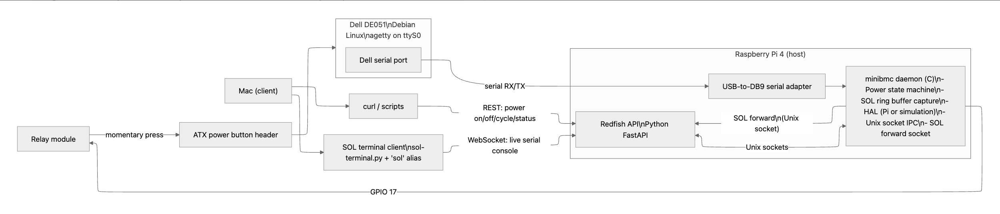

# MiniBMC

A Baseboard Management Controller (BMC) firmware implementation written in C, targeting the Raspberry Pi 4 as a management controller for an x86 server (Dell DE051). Implements remote power control, Serial-Over-LAN console access, a Redfish-compatible REST API, and a platform-independent hardware abstraction layer.

---

## Overview

Modern servers include a dedicated BMC — a microcontroller that manages the host independently of the main CPU. The BMC handles remote power control, hardware monitoring, and out-of-band console access even when the host is powered off or unresponsive.

MiniBMC replicates this architecture using a Raspberry Pi 4 as the management controller. It controls the host's ATX power button via a GPIO-driven relay, captures the host's serial console output (SOL), and exposes a Redfish-compatible REST API and WebSocket console for remote management.

---

## Architecture



### Software Architecture

```
┌─────────────────────────────────────────────────────────┐
│                        main.c                           │
│              100 Hz event loop, signal handling         │
├───────────────────┬─────────────────┬───────────────────┤
│  power_controller │       sol       │       HAL         │
│  (state machine)  │  (SOL capture)  │   (hal.h API)     │
│                   ├─────────────────┤                   │
│                   │   ring_buffer   ├─────────┬─────────┤
│                   │   (byte FIFO)   │ hal_sim │hal_rpi4 │
└───────────────────┴────────┬────────┴─────────┴─────────┘
                             │ Unix sockets
              ┌──────────────┴──────────────┐
              │       redfish/api.py        │
              │   FastAPI + uvicorn         │
              │   REST API + WebSocket SOL  │
              └─────────────────────────────┘
```

The core logic (`power_controller`, `sol`, `ring_buffer`) is fully platform-independent. The HAL interface (`hal.h`) abstracts all hardware access — `hal_rpi4.c` implements it for the Pi 4, while `hal_sim.c` implements it for simulation and unit testing on any host machine.

The C daemon communicates with the Python API via two Unix domain sockets:
- `/var/run/minibmc.sock` — power control IPC
- `/var/run/minibmc-sol.sock` — bidirectional serial console

**Power State Machine:**
```
        [POWER_BUTTON_PRESSED]
OFF ──────────────────────────> POWERING_ON ──[POWER_GOOD]──> ON
 ^                                   │                         │
 │                               [TIMEOUT]               [SHUTDOWN_REQ]
 │                                   v                         v
 │                                 ERROR               SHUTTING_DOWN
 └───────────────────[POWER_LOST]──────────────────────────────┘
```

**SOL Data Flow:**
```
Host DB9 serial port
       │
  USB-Serial cable
       │
  /dev/ttyUSB0
       │
  hal_uart_read_byte()         ← HAL reads raw bytes from UART
       │
  sol_poll()                   ← SOL buffers bytes and forwards to client
       │
  /var/run/minibmc-sol.sock    ← Unix socket to Python API
       │
  WebSocket /redfish/v1/Systems/1/SOL
       │
  sol-terminal.py              ← raw-mode terminal client
```

---

## Hardware Setup

### Components
- Raspberry Pi 4 (BMC)
- Dell DE051 desktop (managed host)
- Tolako 1-channel 5V relay module (power button control)
- USB-to-DB9 serial cable (Serial-Over-LAN)

### Wiring

**Power Button Control (GPIO 17 → Relay → ATX Power Button):**
```
RPi4 GPIO17 (pin 11) ──> Relay IN
RPi4 5V     (pin 2)  ──> Relay VCC
RPi4 GND    (pin 6)  ──> Relay GND
Relay NO ──────────────> Dell ATX power button pins
```

**Serial Console (USB-Serial → Dell DB9):**
```
RPi4 USB port ──> USB-Serial adapter ──> Dell DB9 serial port
                  (/dev/ttyUSB0)
```

### GPIO Pin Assignments

| Signal        | GPIO | Direction | Description                           |
|---------------|------|-----------|---------------------------------------|
| POWER_BUTTON  | 17   | Output    | Relay control — ATX power button      |
| POWER_GOOD    | 18   | Input     | ATX power good signal (not wired yet) |
| POWER_LED     | 22   | Output    | Power state indicator LED             |
| STATUS_LED    | 23   | Output    | BMC heartbeat LED                     |

---

## Project Structure

```
minibmc/
├── Makefile
├── src/
│   ├── main.c                  ← event loop, IPC sockets, SOL socket, signal handling
│   ├── core/
│   │   ├── power_controller.c  ← ATX power state machine
│   │   ├── power_controller.h
│   │   ├── ring_buffer.c       ← lock-free circular byte buffer
│   │   ├── ring_buffer.h
│   │   ├── sol.c               ← Serial-Over-LAN console capture
│   │   └── sol.h
│   ├── hal/
│   │   ├── hal.h               ← platform-independent HAL interface
│   │   ├── hal_rpi4.c          ← Raspberry Pi 4 backend (gpiochip v2, UART)
│   │   └── hal_sim.c           ← simulation backend (PTY + fake POST messages)
│   └── platform/
│       └── rpi4/
│           ├── gpio.h          ← BCM2711 GPIO register definitions and mmap helpers
│           └── uart.h          ← UART device path
├── redfish/
│   ├── api.py                  ← FastAPI Redfish REST API + WebSocket SOL endpoint
│   ├── sol-terminal.py         ← raw-mode terminal client for SOL
│   └── requirements.txt
└── tests/
    ├── test_power_controller.c ← 8 power state machine unit tests
    ├── test_ring_buffer.c      ← 8 ring buffer unit tests
    ├── test_sol.c              ← 4 SOL unit tests
    └── hal_uart_stub.c         ← UART stub for SOL tests
```

---

## Build

**Requirements:**
- Linux or macOS for simulation/tests
- `gcc` or `aarch64-linux-gnu-gcc` for Pi 4 cross-compilation

```bash
# Run unit tests (simulation, works on any machine)
make test

# Build for Raspberry Pi 4 (native on Pi)
make PLATFORM=rpi4

# Cross-compile for Pi 4 (from x86 Linux)
make PLATFORM=rpi4 CC=aarch64-linux-gnu-gcc

# Clean build artifacts
make clean
```

---

## Usage

### Power Control

```bash
# Power on
curl -X POST http://10.0.0.136:8000/redfish/v1/Systems/1/Actions/ComputerSystem.Reset \
  -H 'Content-Type: application/json' \
  -d '{"ResetType":"On"}'

# Graceful shutdown
curl -X POST http://10.0.0.136:8000/redfish/v1/Systems/1/Actions/ComputerSystem.Reset \
  -H 'Content-Type: application/json' \
  -d '{"ResetType":"GracefulShutdown"}'

# Power cycle (graceful shutdown, then power on after 10s)
curl -X POST http://10.0.0.136:8000/redfish/v1/Systems/1/Actions/ComputerSystem.Reset \
  -H 'Content-Type: application/json' \
  -d '{"ResetType":"ForceRestart"}'

# Power status
curl http://10.0.0.136:8000/redfish/v1/Systems/1
```

### Serial Console (SOL)

```bash
# Connect to host serial console (Ctrl+] to exit)
sol
# or
sol 10.0.0.136
```

`sol` is a shell alias for `python3 ~/Downloads/minibmc/redfish/sol-terminal.py`.

---

## Systemd Services

```bash
# Install and enable services
sudo cp minibmc.service /etc/systemd/system/
sudo cp minibmc-api.service /etc/systemd/system/
sudo systemctl enable minibmc minibmc-api
sudo systemctl start minibmc minibmc-api
```

---

## Roadmap

- [ ] Wire GPIO 18 to ATX POWER_GOOD signal for hardware state detection
- [ ] Hardware monitoring (temperature, fan speed via I2C/SPI)
- [ ] IPMI over LAN support
